# 🛡️ SIEM-система на базе Elastic Stack для кадрового агентства

---

## 📌 Краткое описание

Данный проект представляет собой функциональный прототип SIEM-системы.

## 🛠️ Инструменты и технологии

| Компонент | Назначение |
|-----------|------------|
| **Elasticsearch** | Хранение и индексация логов |
| **Kibana** | Визуализация, дашборды, система оповещений |
| **Winlogbeat** | Сбор событий с Windows (AD, файловый сервер) |
| **Filebeat** | Сбор логов Suricata |
| **Suricata** | Обнаружение сетевых атак (NIDS) |
| **VirtualBox** | Виртуализация стенда |
| **CentOS 9** | Сервер Elastic Stack |
| **Windows 10 / Server 2019** | Клиентские системы |
| **Astra Linux** | Дополнительный агент 

## 🧪 Экспериментальная часть

### Топология стенда

Эксперимент проводился на гипервизоре **Virtual Box** с использованием сетевого моста (Bridge) для обеспечения взаимодействия между виртуальными машинами.

---

### Настройка Elastic Stack

На сервер CentOS 9 была выполнена установка Elasticsearch и Kibana. После запуска служб веб-интерфейс Kibana стал доступен с хостовой системы.

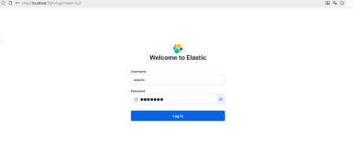

В разделе **Discover** была проверена доставка логов от агентов.

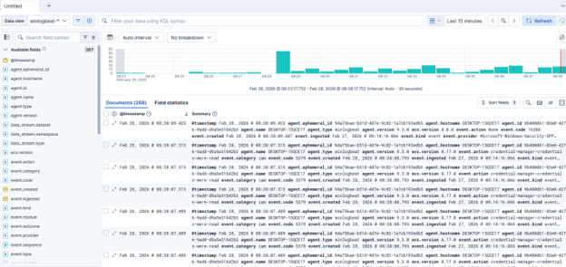

---

### Настройка сбора событий Active Directory

Для сбора событий Active Directory был создан отдельный Data View в Kibana.

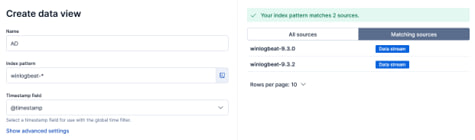

В разделе Discover отображаются события, поступающие с контроллера домена через Winlogbeat.

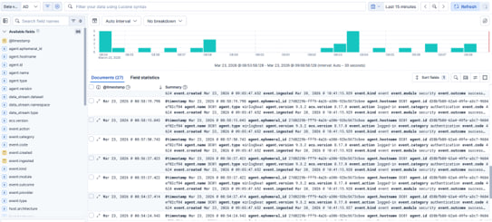

Было разработано правило для обнаружения попытки смены пароля в AD.

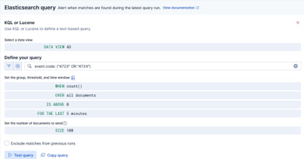

---

### Тестирование встроенных правил Elastic Security

#### Обнаружение сканирования портов

С помощью **nmap** было выполнено сканирование сетевых портов Elastic-сервера.

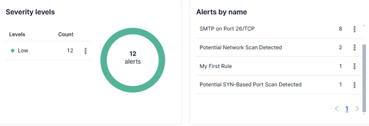

Система зафиксировала события типа **"Potential Network Scan"** и **"Potential SYN-Based Port Scan"**, что подтверждает эффективность встроенных правил.

---

#### Обнаружение Brute Force SSH

С помощью инструмента **Hydra** была выполнена атака подбора паролей на SSH-сервис.

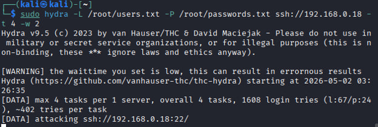

В Kibana зафиксировано событие **"Potential Password Spraying attack via SSH"**.

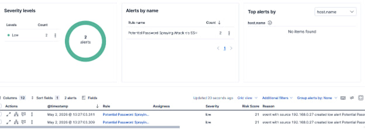

Аналогичная атака была проведена на агент с **Astra Linux**.

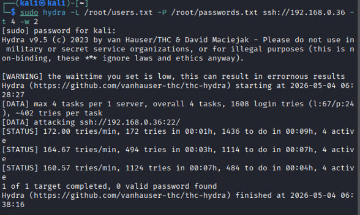

Событие успешно зафиксировано в Kibana с указанием источника — агента Astra.

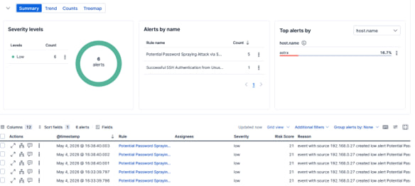

---

### Настройка пользовательских правил

#### Интеграция Suricata

В инфраструктуру была внедрена система обнаружения вторжений **Suricata**. Для проверки работы было создано сигнатурное правило, обнаруживающее ICMP Flood (превышение частоты ICMP-пакетов).

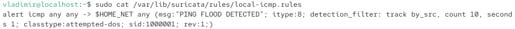

После проведения атаки в лог-файлах Suricata появились записи "ICMP FLOOD DETECTED".

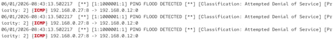

События были успешно доставлены в Kibana через Filebeat.

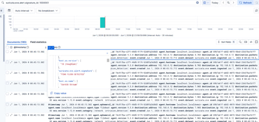

Запуск ICMP Flood атаки:

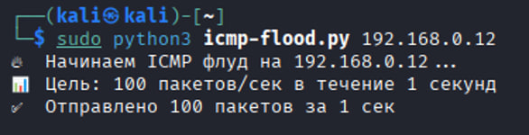

В разделе **Alerts** зафиксирован сигнал тревоги от правила Suricata.

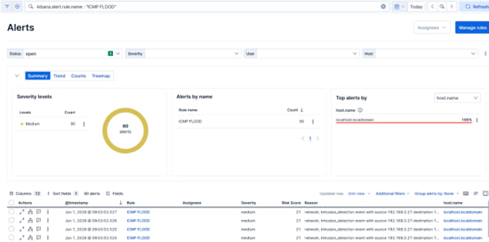

